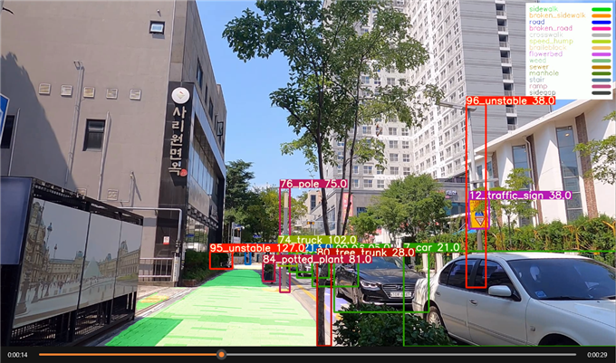
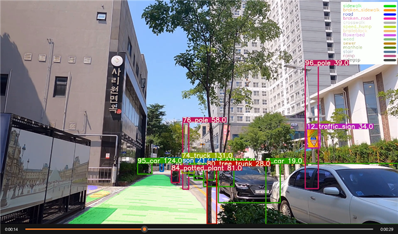
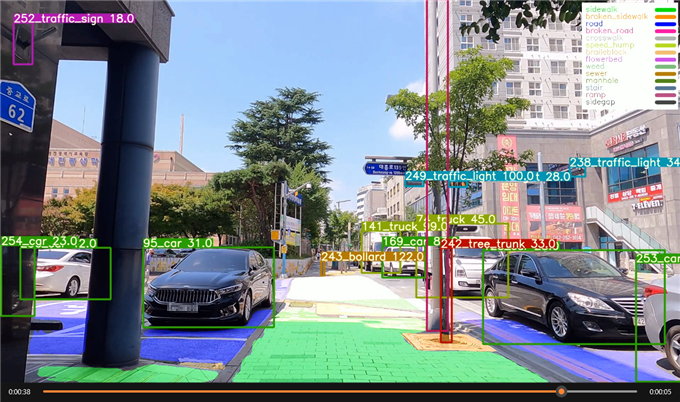

# Sidewalk_Obstacle_Detect
Detect sidewalk obstacles with Object detection, Object tracking, Instance segmentation and depth estimation    

# Demo
Label structure : {TrackedID_Class_Depth}    

1. Unstable (ID 95)    

2. Stable (ID 95)    

3. Keep track during 24s(ID 95)    

## Acknowledgement
Yolov7 [https://github.com/WongKinYiu/yolov7](https://github.com/WongKinYiu/yolov7)    
ByteTrack  [https://github.com/ifzhang/ByteTrack](https://github.com/ifzhang/ByteTrack)    
MMDetection  [https://github.com/open-mmlab/mmdetection](https://github.com/open-mmlab/mmdetection)    
ConvNext  [https://github.com/facebookresearch/ConvNeXt](https://github.com/facebookresearch/ConvNeXt)    
GLPDepth  [https://github.com/vinvino02/GLPDepth](https://github.com/vinvino02/GLPDepth)    
